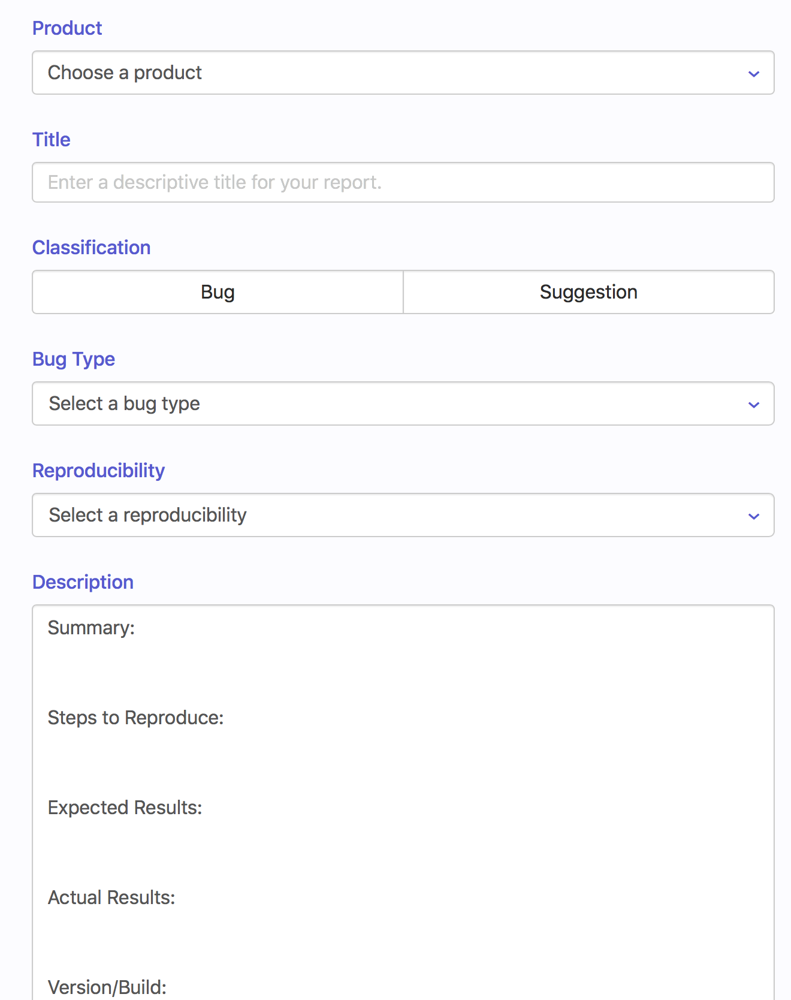
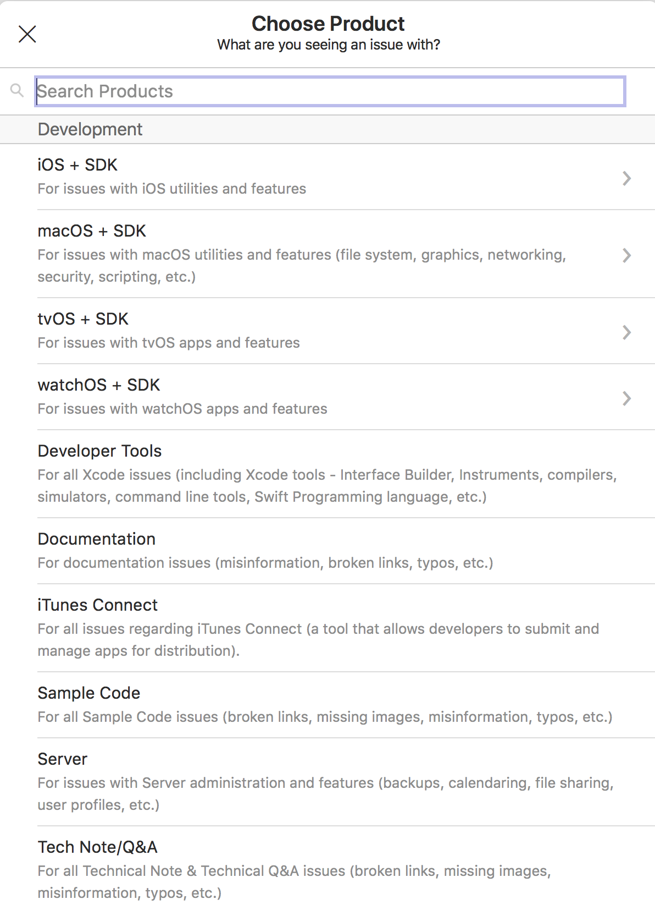
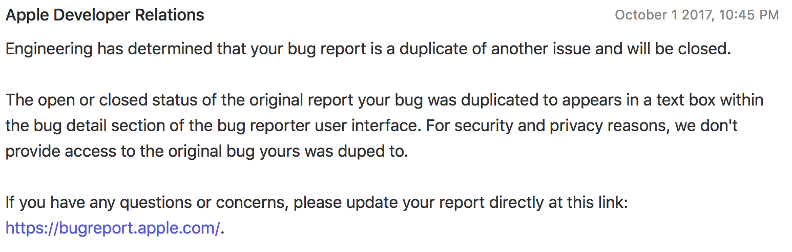
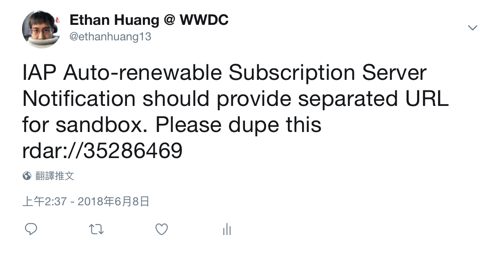

# 如何報 bug 給 Apple

遇到 Apple SDK 或是 App Store 的相關問題或建議，怎麼回報給官方呢？可以透過 Apple 官方的 bug reporting system，叫做 Radar。

### 發 Radar

只要你有 Apple Developer 帳號（除非涉及公司機密，我建議用個人的帳號），就可以登入 [Radar](https://bugreport.apple.com) 來新增 bug 給官方。這個動作叫做 **file a radar**。如果有機會去 WWDC 與 Apple 工程師面對面問問題，很有機會會被對方問說有沒有開過 radar、編號多少，或請你開個新的出來。

開 Radar 實在很簡單，就是選好問題領域、把重現步驟描述出來，必要時加上系統 log、sample project、截圖、或影片。

由於不同的 Framework 的 log 產自不同地方，請參考[這個網站](https://developer.apple.com/bug-reporting/profiles-and-logs/)來產生需要的 log。

### 獲得回覆

絕大多數的 radar，Apple 的工程師都不會親自回覆。畢竟 Apple 是一個很大的公司，不見得有資源去處理你的問題，所以那些 radar 就保持著 Open 的狀態。更有可能的是你的問題已經有人報過了，所以就簡單地被標記成 duped，就沒有下文。換言之，大部分開發者對 radar 的感覺都是像黑洞一樣有去無回。

即便是這樣，我認為該發的 radar 還是要發。原因如下 ：

1. 如果沒有發 radar，這個問題可能根本沒有人知道
2. Radar 畢竟是一套追蹤系統，除了讓 Apple 知道問題以外，你也可以檢視以前報過的問題。有時候新版系統推出後，舊問題就解決了
3. 在發 radar 的過程，你會把問題縮限在可重現的範圍、排除不相關的原因、或是更清楚找到問題所在
4. 每年 WWDC 時，你可以帶著懸而未解的 radars 去 lab 罵人（誤）
5. 即使被標記成 duplicated，你提供的資訊也有可能讓問題成因更加明確，幫助解決問題
6. 身為工程師，能把軟體的 bug 清楚表達出來，也是基本素養。發 radar 是個好訓練
7. 在 Apple Developer Forums 上面寫跟 Apple 工程師對話時，也可以標上 radar
8. 對於非技術、商業政策方面的問題，也是可以發 radar
9. 可以使用 Open radar，下面會說明

### Open Radar

官方的 Radar 是不公開的（基於開發者隱私或機密的原因）。然而，有時候開發者想互相交換 radar 的內容，追蹤某個 bug 是不是已經有人發過了、有沒有回覆等等。所以就有開發者社群建立了 Open Radar 這個網站，任何開發者可以自行把發給 Apple 的 radar 內容複製貼上過去。

有的時候，如果某開發者覺得某個 bug 很嚴重，為了希望引起官方的重視，他自己會先 file a radar，公開到 Open Radar，然後上網「呼籲」其他開發者複製這個 radar。比如在 Twitter 上說 "Please dupe this radar..."

### 參考資料

#### 官方

* [Submitting Bugs and Feedback](https://developer.apple.com/bug-reporting/)
* [Bug Reporter](https://bugreport.apple.com/) \(Radar\)
* [Profiles and Logs](https://developer.apple.com/bug-reporting/profiles-and-logs/)

#### 非官方

* [Open Radar](https://openradar.appspot.com)

