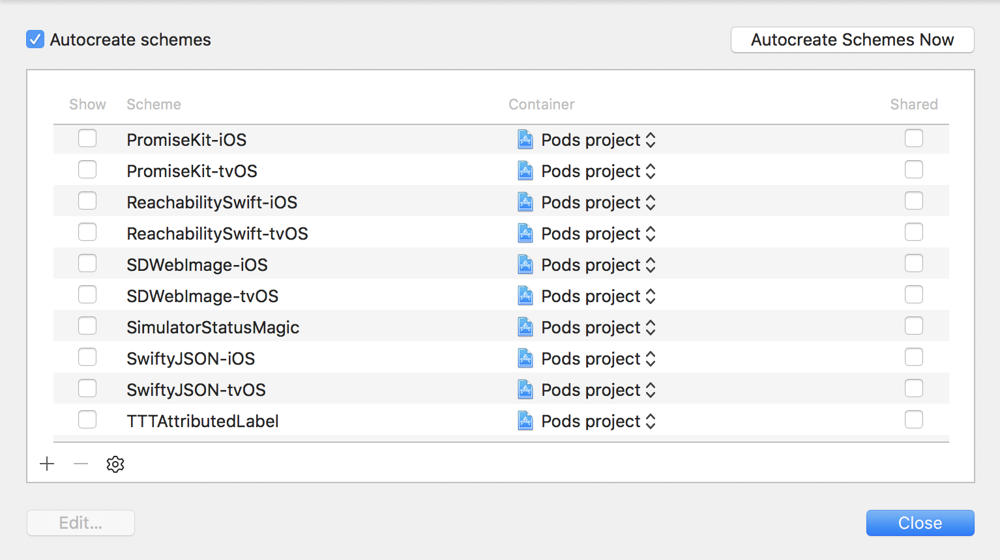
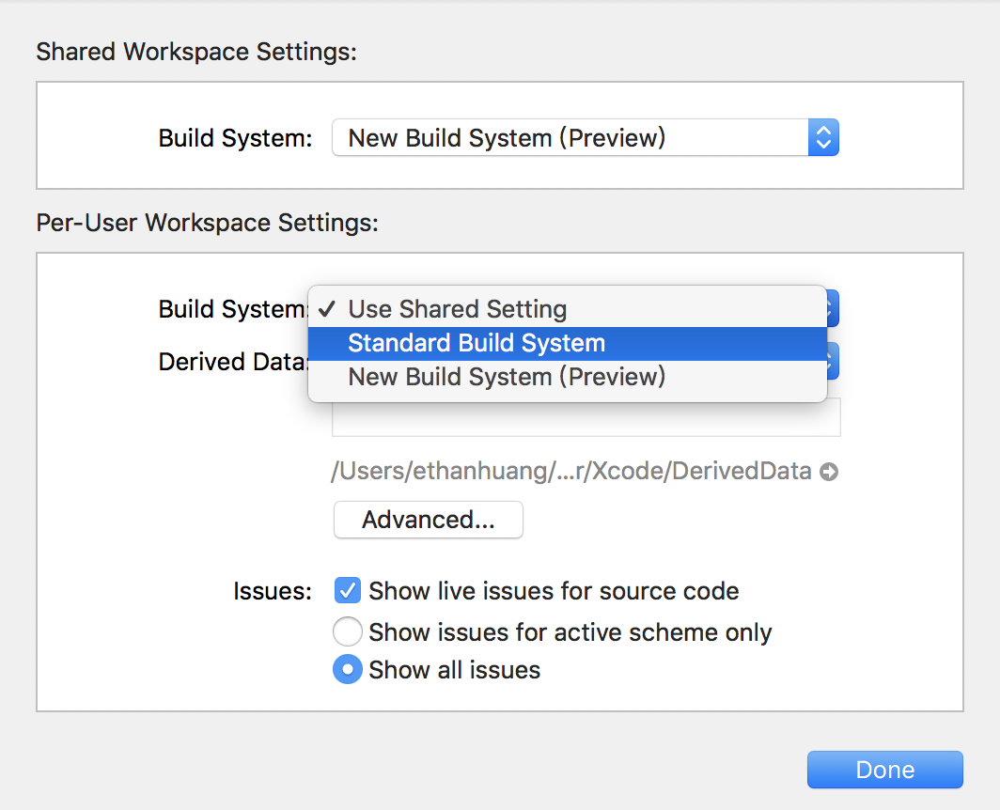

# Git 不能保證專案在每台電腦上的狀態完全一樣

## .gitignore 之你忽略了誰？

列在 .gitignore 的檔案，git 就不會去偵測。通常我們會拿掉 `*.pbxuser`、`xcuserdata/`、`*.xcuserstate`等等。

但是有些 Xcode 所用的設定，就在這些檔案裡面。

比如說你在使用的是沒有勾選為 **Shared** 的 scheme，那別台電腦就不會有你這個 scheme 的設定。這裡 **Shared** 的意思就是會加進版控啦。scheme 掌管了 Build、Run、Test、Analyze、Archive 等諸多情境的細部設定。改了半天只在自己的電腦上有效，沒有同步回 git，不是很冤嗎？

或者是 workspace 設定。比如你玩了一把 Xcode 9 的 _New Build System_ 之後，發現有 bug 會 build 不過，就改回 _Standard Build System_，但卻是改在 **Per-User** 而不是 **Shared**，導致別台電腦還是在用新的。

## 空資料夾

Git 是無視空資料夾的。但是 Xcode 在搜尋路徑用的 Header Search Paths 會考慮資料夾。

我就曾經遇過這種坑，同事換了 framework 的位置，但 Header Search Paths 設定沒拿掉舊的。他的電腦可以 build，我 pull 後卻一直不能 build，說找不到東西。因為我的空資料夾還在。砍掉後，就正常了。

## 檔名大小寫

Mac 預設給硬碟的檔案系統是不分大小寫的。在這種情況下，你把檔名大小寫改掉，Git 是偵測不出來的。但是 iOS 的檔案系統卻是區分大小寫。兩者的差異，使得以下這種情況是有可能發生的：

用 Swift 的 _\#imageLiteral_ 來指定圖片名稱。去把圖檔改檔名的大小寫，Xcode 會給你 build（會有警告），Git 看不出差異，但是 app 執行到的時候就會掛掉。

以上。不是要提出解法，只是講一下有這些坑 。

