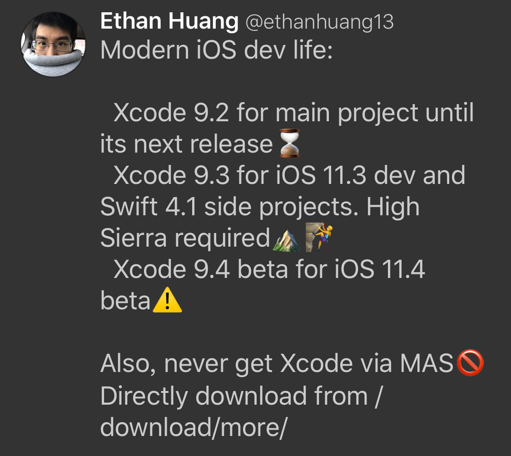
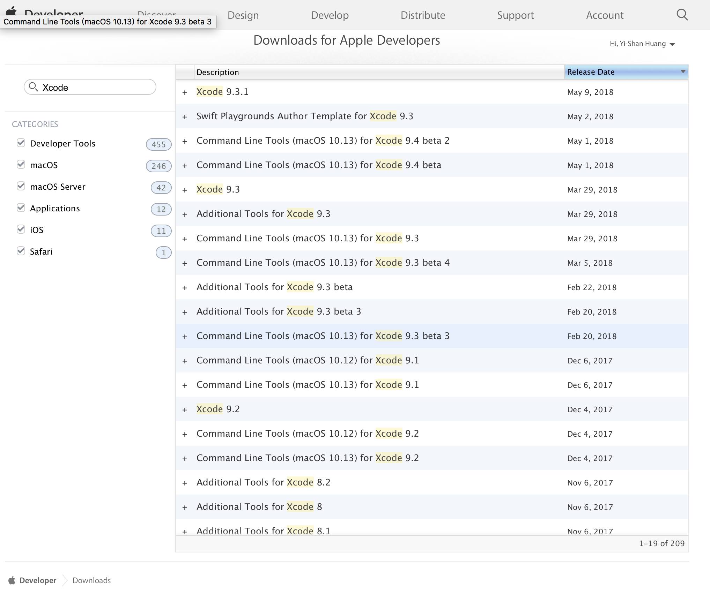

# 下載 Xcode 的正確姿勢

如果你是積極跟上新版 Xcode 的開發者，常常下載更新版是免不了的。有的時候還會要裝兩到三個版本。像這樣：



怎樣下載 Xcode 呢？最簡單的方式當然是透過 Mac App Store。

但是 MAS 有幾個問題，我極力避免：

* 下載過程中，Xcode 不能使用
* MAS 傳輸進度有時候會中斷或不知道怎麼了
* 有新版時會一直提示你要更新
* 只能維持一個 Xcode 版本。實際上開發時可能會用到多個版本
* 不能下載 beta 版

## 從 Download -&gt; More 下載

因此，我都是從 [https://developer.apple.com/download/more/](https://developer.apple.com/download/more/) 下載我需要的版本。這個頁面如果從 [Download](https://developer.apple.com/download/) 進去的話，要捲動到最下面才看得到。




## 透過 xcode-install

你也可以透過 [xcode-install](https://github.com/KrauseFx/xcode-install) 這個 ruby 套件，用指令來下載，會更加方便。例如：

```bash
$ gem install xcode-install
$ xcversion install 9.3.1
```

唯一要注意的是，這個套件會把你的 Apple ID 跟密碼存在電腦 Keychain 裡面，跟 fastlane 的原理一樣。

